# Order Management System (OMS) - System Process Flow

## Overview

This document describes the system process flow for the OMS Frontend Application, a React-based SPA for managing orders, products, customers, inventory, and user administration.

---

## 1. Authentication & Authorization Flow

### 1.1 Admin/Staff Authentication

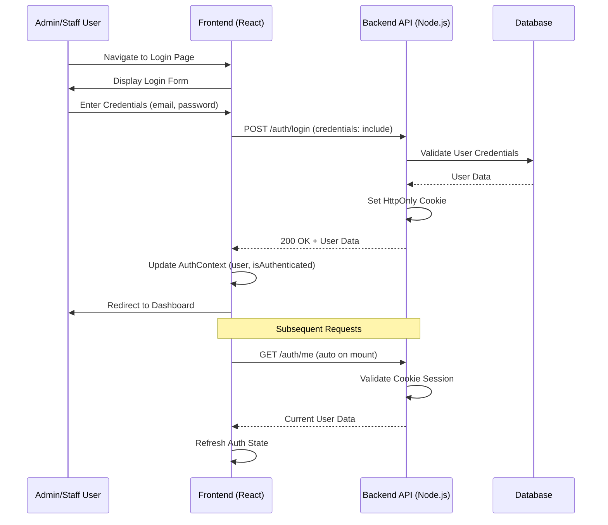
```mermaid
sequenceDiagram
    participant User as Admin/Staff User
    participant FE as Frontend (React)
    participant API as Backend API (Node.js)
    participant DB as Database

    User->>FE: Navigate to Login Page
    FE->>User: Display Login Form
    User->>FE: Enter Credentials (email, password)
    FE->>API: POST /auth/login (credentials: include)
    API->>DB: Validate User Credentials
    DB-->>API: User Data
    API->>API: Set HttpOnly Cookie
    API-->>FE: 200 OK + User Data
    FE->>FE: Update AuthContext (user, isAuthenticated)
    FE->>User: Redirect to Dashboard

    Note over FE,API: Subsequent Requests
    FE->>API: GET /auth/me (auto on mount)
    API->>API: Validate Cookie Session
    API-->>FE: Current User Data
    FE->>FE: Refresh Auth State
```

### 1.2 Customer Portal Authentication

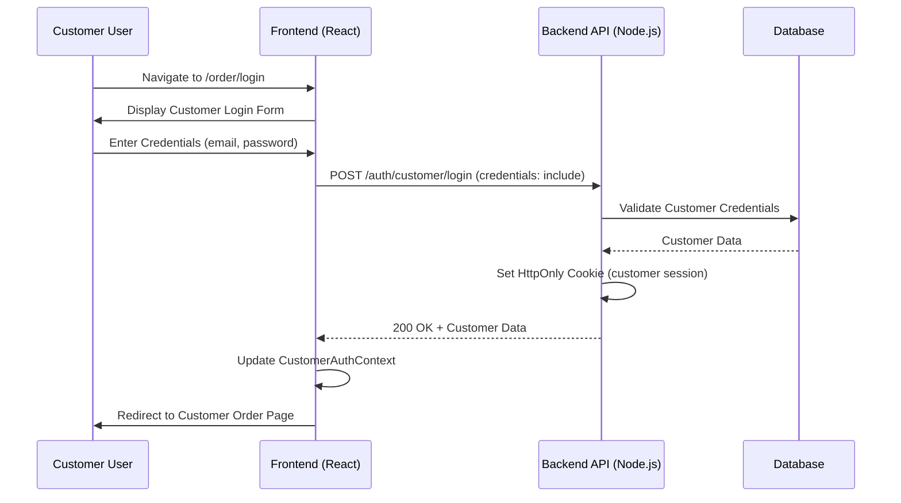
```mermaid
sequenceDiagram
    participant Customer as Customer User
    participant FE as Frontend (React)
    participant API as Backend API (Node.js)
    participant DB as Database

    Customer->>FE: Navigate to /order/login
    FE->>Customer: Display Customer Login Form
    Customer->>FE: Enter Credentials (email, password)
    FE->>API: POST /auth/customer/login (credentials: include)
    API->>DB: Validate Customer Credentials
    DB-->>API: Customer Data
    API->>API: Set HttpOnly Cookie (customer session)
    API-->>FE: 200 OK + Customer Data
    FE->>FE: Update CustomerAuthContext
    FE->>Customer: Redirect to Customer Order Page
```

### 1.3 Permission-Based Access Control

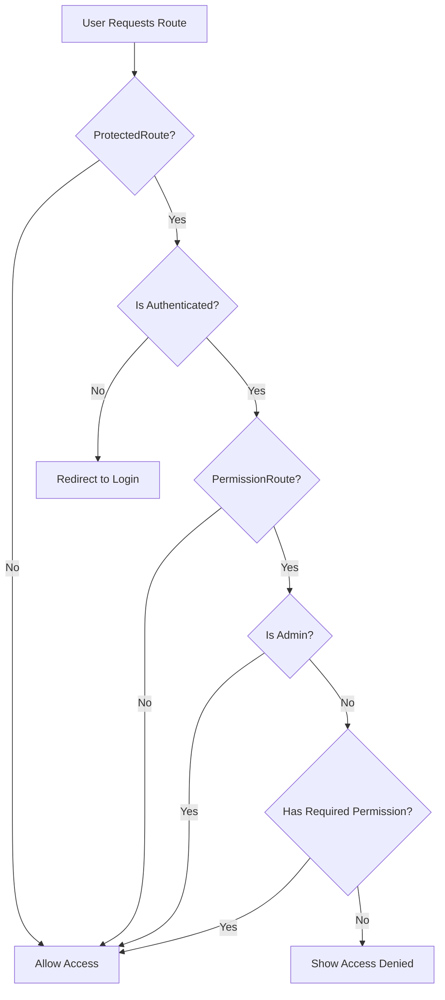
```mermaid
flowchart TD
    A[User Requests Route] --> B{ProtectedRoute?}
    B -->|No| C[Allow Access]
    B -->|Yes| D{Is Authenticated?}
    D -->|No| E[Redirect to Login]
    D -->|Yes| F{PermissionRoute?}
    F -->|No| C
    F -->|Yes| G{Is Admin?}
    G -->|Yes| C
    G -->|No| H{Has Required Permission?}
    H -->|Yes| C
    H -->|No| I[Show Access Denied]
```

**Permission Categories:**
- `dashboard.view`
- `products.view`, `products.manage`
- `orders.view`, `orders.manage`
- `customers.view`, `customers.manage`
- `inventory.view`, `inventory.manage`
- `audit.view`
- `users.manage`

---

## 2. Application Startup Flow

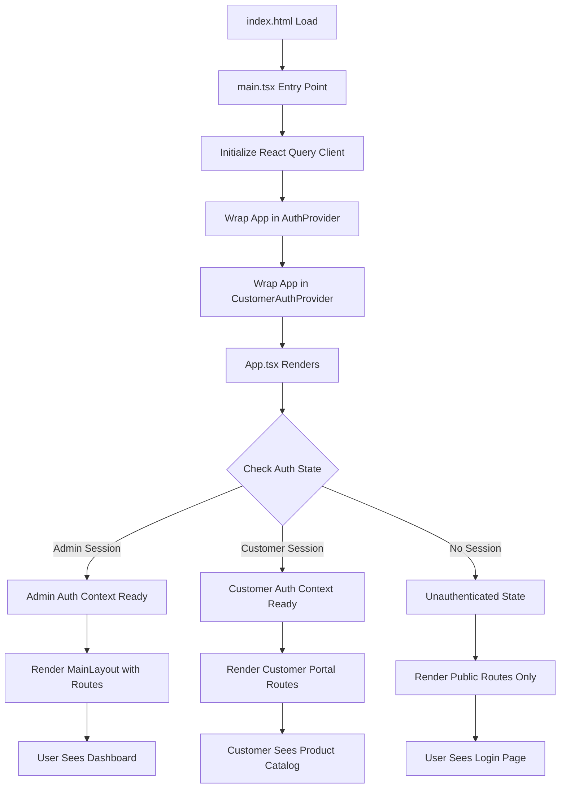
```mermaid
flowchart TD
    A[index.html Load] --> B[main.tsx Entry Point]
    B --> C[Initialize React Query Client]
    C --> D[Wrap App in AuthProvider]
    D --> E[Wrap App in CustomerAuthProvider]
    E --> F[App.tsx Renders]
    F --> G{Check Auth State}
    G -->|Admin Session| H[Admin Auth Context Ready]
    G -->|Customer Session| I[Customer Auth Context Ready]
    G -->|No Session| J[Unauthenticated State]
    H --> K[Render MainLayout with Routes]
    I --> L[Render Customer Portal Routes]
    J --> M[Render Public Routes Only]
    K --> N[User Sees Dashboard]
    L --> O[Customer Sees Product Catalog]
    M --> P[User Sees Login Page]
```

---

## 3. Data Fetching Flow (TanStack Query)

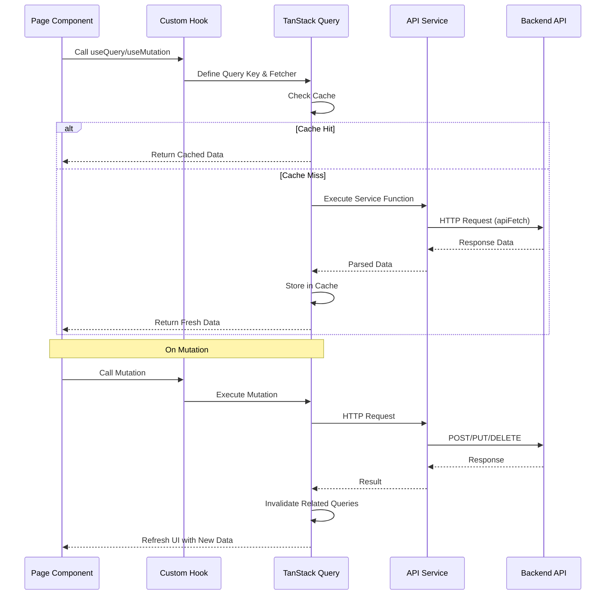
```mermaid
sequenceDiagram
    participant Page as Page Component
    participant Hook as Custom Hook
    participant Query as TanStack Query
    participant Service as API Service
    participant API as Backend API

    Page->>Hook: Call useQuery/useMutation
    Hook->>Query: Define Query Key & Fetcher
    Query->>Query: Check Cache
    alt Cache Hit
        Query-->>Page: Return Cached Data
    else Cache Miss
        Query->>Service: Execute Service Function
        Service->>API: HTTP Request (apiFetch)
        API-->>Service: Response Data
        Service-->>Query: Parsed Data
        Query->>Query: Store in Cache
        Query-->>Page: Return Fresh Data
    end

    Note over Page,Query: On Mutation
    Page->>Hook: Call Mutation
    Hook->>Query: Execute Mutation
    Query->>Service: HTTP Request
    Service->>API: POST/PUT/DELETE
    API-->>Service: Response
    Service-->>Query: Result
    Query->>Query: Invalidate Related Queries
    Query-->>Page: Refresh UI with New Data
```

---

## 4. Core Feature Flows

### 4.1 Order Management Flow

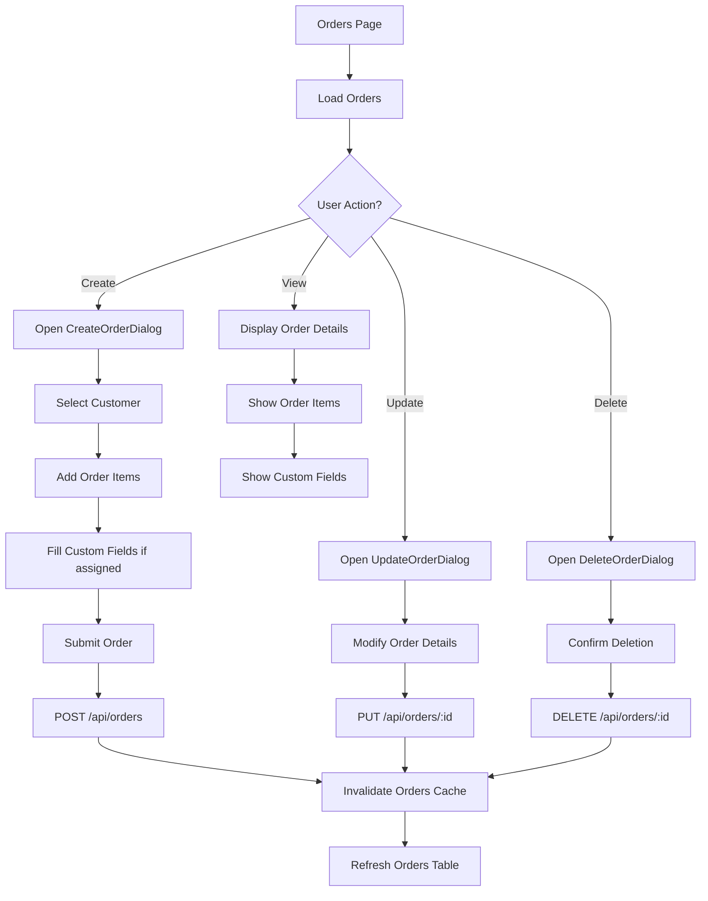
```mermaid
flowchart TD
    A[Orders Page] --> B[Load Orders]
    B --> C{User Action?}
    C -->|Create| D[Open CreateOrderDialog]
    D --> E[Select Customer]
    E --> F[Add Order Items]
    F --> G[Fill Custom Fields if assigned]
    G --> H[Submit Order]
    H --> I[POST /api/orders]
    I --> J[Invalidate Orders Cache]
    J --> K[Refresh Orders Table]

    C -->|Update| L[Open UpdateOrderDialog]
    L --> M[Modify Order Details]
    M --> N[PUT /api/orders/:id]
    N --> J

    C -->|Delete| O[Open DeleteOrderDialog]
    O --> P[Confirm Deletion]
    P --> Q[DELETE /api/orders/:id]
    Q --> J

    C -->|View| R[Display Order Details]
    R --> S[Show Order Items]
    S --> T[Show Custom Fields]
```

### 4.2 Product Management Flow

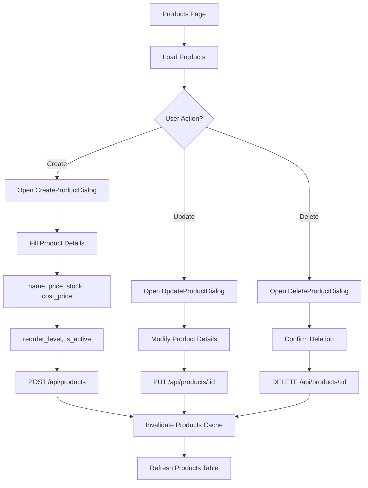
```mermaid
flowchart TD
    A[Products Page] --> B[Load Products]
    B --> C{User Action?}
    C -->|Create| D[Open CreateProductDialog]
    D --> E[Fill Product Details]
    E --> F[name, price, stock, cost_price]
    F --> G[reorder_level, is_active]
    G --> H[POST /api/products]
    H --> I[Invalidate Products Cache]
    I --> J[Refresh Products Table]

    C -->|Update| K[Open UpdateProductDialog]
    K --> L[Modify Product Details]
    L --> M[PUT /api/products/:id]
    M --> I

    C -->|Delete| N[Open DeleteProductDialog]
    N --> O[Confirm Deletion]
    O --> P[DELETE /api/products/:id]
    P --> I
```

### 4.3 Customer Management Flow

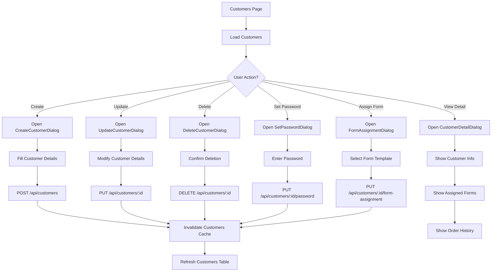
```mermaid
flowchart TD
    A[Customers Page] --> B[Load Customers]
    B --> C{User Action?}
    C -->|Create| D[Open CreateCustomerDialog]
    D --> E[Fill Customer Details]
    E --> F[POST /api/customers]
    F --> G[Invalidate Customers Cache]
    G --> H[Refresh Customers Table]

    C -->|Update| I[Open UpdateCustomerDialog]
    I --> J[Modify Customer Details]
    J --> K[PUT /api/customers/:id]
    K --> G

    C -->|Delete| L[Open DeleteCustomerDialog]
    L --> M[Confirm Deletion]
    M --> N[DELETE /api/customers/:id]
    N --> G

    C -->|View Detail| O[Open CustomerDetailDialog]
    O --> P[Show Customer Info]
    P --> Q[Show Assigned Forms]
    Q --> R[Show Order History]

    C -->|Set Password| S[Open SetPasswordDialog]
    S --> T[Enter Password]
    T --> U[PUT /api/customers/:id/password]
    U --> G

    C -->|Assign Form| V[Open FormAssignmentDialog]
    V --> W[Select Form Template]
    W --> X[PUT /api/customers/:id/form-assignment]
    X --> G
```

### 4.4 Inventory Management Flow

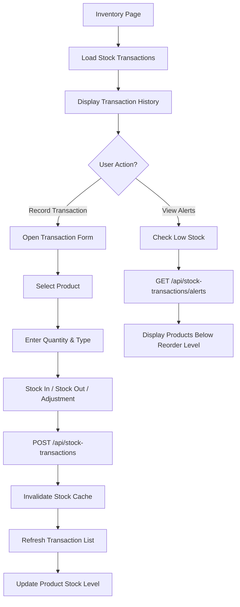
```mermaid
flowchart TD
    A[Inventory Page] --> B[Load Stock Transactions]
    B --> C[Display Transaction History]
    C --> D{User Action?}
    D -->|Record Transaction| E[Open Transaction Form]
    E --> F[Select Product]
    F --> G[Enter Quantity & Type]
    G --> H[Stock In / Stock Out / Adjustment]
    H --> I[POST /api/stock-transactions]
    I --> J[Invalidate Stock Cache]
    J --> K[Refresh Transaction List]
    K --> L[Update Product Stock Level]

    D -->|View Alerts| M[Check Low Stock]
    M --> N[GET /api/stock-transactions/alerts]
    N --> O[Display Products Below Reorder Level]
```

### 4.5 User Management Flow (Admin Only)

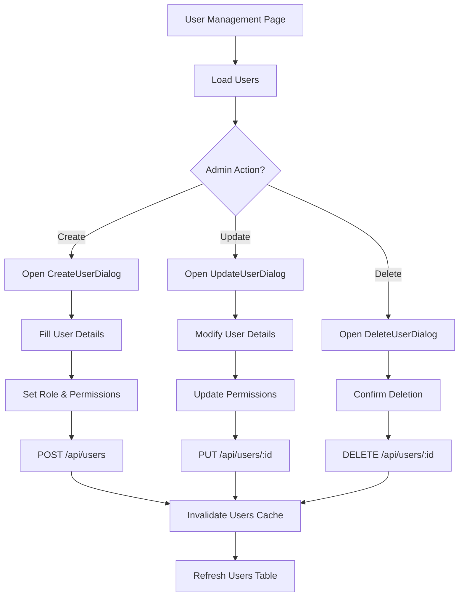
```mermaid
flowchart TD
    A[User Management Page] --> B[Load Users]
    B --> C{Admin Action?}
    C -->|Create| D[Open CreateUserDialog]
    D --> E[Fill User Details]
    E --> F[Set Role & Permissions]
    F --> G[POST /api/users]
    G --> H[Invalidate Users Cache]
    H --> I[Refresh Users Table]

    C -->|Update| J[Open UpdateUserDialog]
    J --> K[Modify User Details]
    K --> L[Update Permissions]
    L --> M[PUT /api/users/:id]
    M --> H

    C -->|Delete| N[Open DeleteUserDialog]
    N --> O[Confirm Deletion]
    O --> P[DELETE /api/users/:id]
    P --> H
```

### 4.6 Form Template Management Flow

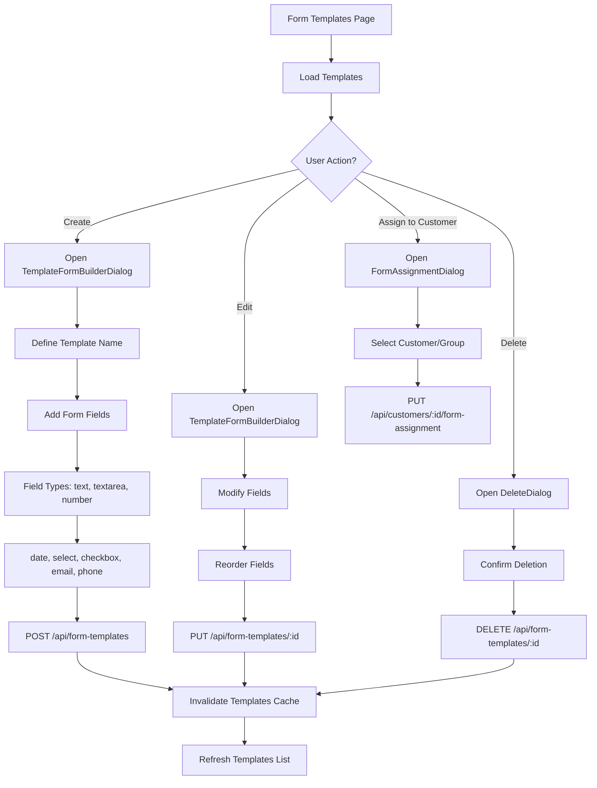
```mermaid
flowchart TD
    A[Form Templates Page] --> B[Load Templates]
    B --> C{User Action?}
    C -->|Create| D[Open TemplateFormBuilderDialog]
    D --> E[Define Template Name]
    E --> F[Add Form Fields]
    F --> G[Field Types: text, textarea, number]
    G --> H[date, select, checkbox, email, phone]
    H --> I[POST /api/form-templates]
    I --> J[Invalidate Templates Cache]
    J --> K[Refresh Templates List]

    C -->|Edit| L[Open TemplateFormBuilderDialog]
    L --> M[Modify Fields]
    M --> N[Reorder Fields]
    N --> O[PUT /api/form-templates/:id]
    O --> J

    C -->|Delete| P[Open DeleteDialog]
    P --> Q[Confirm Deletion]
    Q --> R[DELETE /api/form-templates/:id]
    R --> J

    C -->|Assign to Customer| S[Open FormAssignmentDialog]
    S --> T[Select Customer/Group]
    T --> U[PUT /api/customers/:id/form-assignment]
```

### 4.7 Customer Groups Management Flow

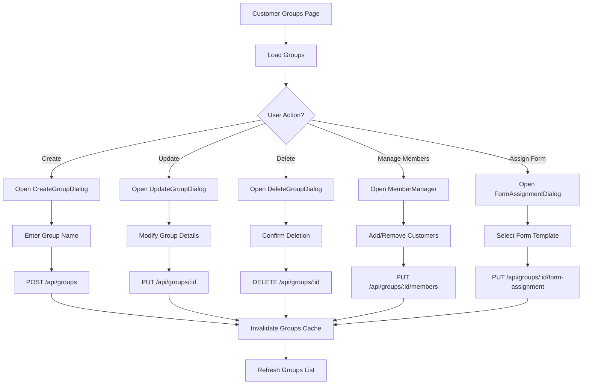
```mermaid
flowchart TD
    A[Customer Groups Page] --> B[Load Groups]
    B --> C{User Action?}
    C -->|Create| D[Open CreateGroupDialog]
    D --> E[Enter Group Name]
    E --> F[POST /api/groups]
    F --> G[Invalidate Groups Cache]
    G --> H[Refresh Groups List]

    C -->|Update| I[Open UpdateGroupDialog]
    I --> J[Modify Group Details]
    J --> K[PUT /api/groups/:id]
    K --> G

    C -->|Delete| L[Open DeleteGroupDialog]
    L --> M[Confirm Deletion]
    M --> N[DELETE /api/groups/:id]
    N --> G

    C -->|Manage Members| O[Open MemberManager]
    O --> P[Add/Remove Customers]
    P --> Q[PUT /api/groups/:id/members]
    Q --> G

    C -->|Assign Form| R[Open FormAssignmentDialog]
    R --> S[Select Form Template]
    S --> T[PUT /api/groups/:id/form-assignment]
    T --> G
```

---

## 5. Customer Portal Flow

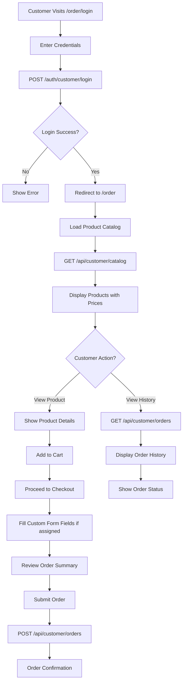
```mermaid
flowchart TD
    A[Customer Visits /order/login] --> B[Enter Credentials]
    B --> C[POST /auth/customer/login]
    C --> D{Login Success?}
    D -->|No| E[Show Error]
    D -->|Yes| F[Redirect to /order]

    F --> G[Load Product Catalog]
    G --> H[GET /api/customer/catalog]
    H --> I[Display Products with Prices]

    I --> J{Customer Action?}
    J -->|View Product| K[Show Product Details]
    K --> L[Add to Cart]

    L --> M[Proceed to Checkout]
    M --> N[Fill Custom Form Fields if assigned]
    N --> O[Review Order Summary]
    O --> P[Submit Order]
    P --> Q[POST /api/customer/orders]
    Q --> R[Order Confirmation]

    J -->|View History| S[GET /api/customer/orders]
    S --> T[Display Order History]
    T --> U[Show Order Status]
```

---

## 6. Dashboard Data Flow

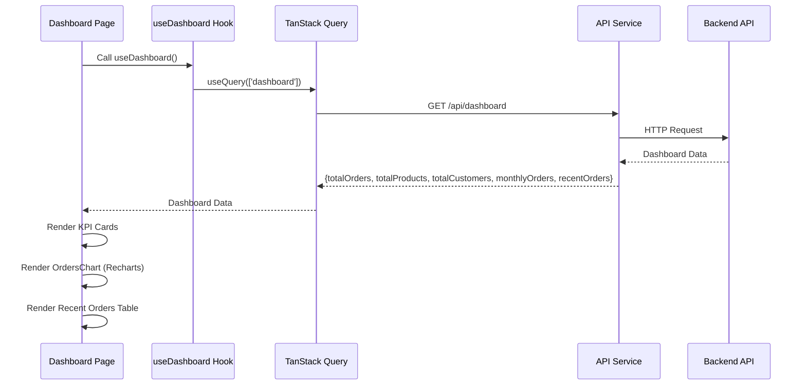
```mermaid
sequenceDiagram
    participant Page as Dashboard Page
    participant Hook as useDashboard Hook
    participant Query as TanStack Query
    participant Service as API Service
    participant API as Backend API

    Page->>Hook: Call useDashboard()
    Hook->>Query: useQuery(['dashboard'])
    Query->>Service: GET /api/dashboard
    Service->>API: HTTP Request
    API-->>Service: Dashboard Data
    Service-->>Query: {totalOrders, totalProducts, totalCustomers, monthlyOrders, recentOrders}
    Query-->>Page: Dashboard Data

    Page->>Page: Render KPI Cards
    Page->>Page: Render OrdersChart (Recharts)
    Page->>Page: Render Recent Orders Table
```

---

## 7. Audit Log Flow

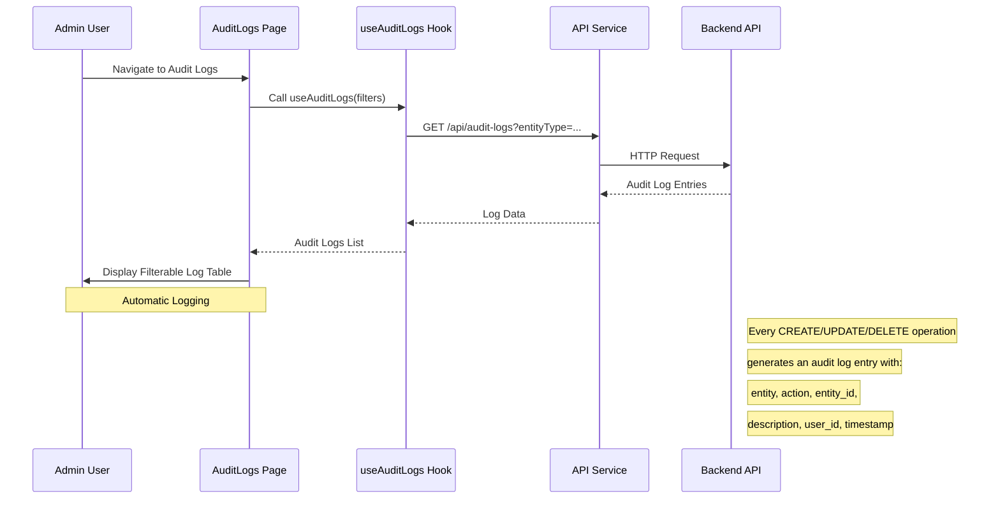
```mermaid
sequenceDiagram
    participant User as Admin User
    participant Page as AuditLogs Page
    participant Hook as useAuditLogs Hook
    participant Service as API Service
    participant API as Backend API

    User->>Page: Navigate to Audit Logs
    Page->>Hook: Call useAuditLogs(filters)
    Hook->>Service: GET /api/audit-logs?entityType=...
    Service->>API: HTTP Request
    API-->>Service: Audit Log Entries
    Service-->>Hook: Log Data
    Hook-->>Page: Audit Logs List
    Page->>User: Display Filterable Log Table

    Note over Page,User: Automatic Logging
    Note right of API: Every CREATE/UPDATE/DELETE operation
    Note right of API: generates an audit log entry with:
    Note right of API: entity, action, entity_id,
    Note right of API: description, user_id, timestamp
```

---

## 8. API Communication Flow

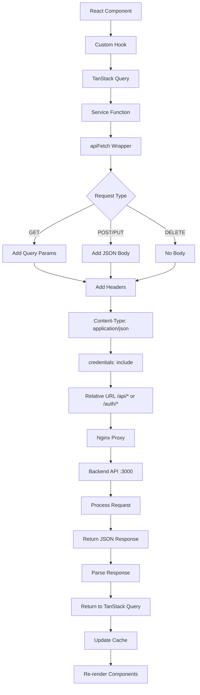
```mermaid
flowchart TD
    A[React Component] --> B[Custom Hook]
    B --> C[TanStack Query]
    C --> D[Service Function]
    D --> E[apiFetch Wrapper]
    E --> F{Request Type}
    F -->|GET| G[Add Query Params]
    F -->|POST/PUT| H[Add JSON Body]
    F -->|DELETE| I[No Body]
    G --> J[Add Headers]
    H --> J
    I --> J
    J --> K[Content-Type: application/json]
    K --> L[credentials: include]
    L --> M[Relative URL /api/* or /auth/*]
    M --> N[Nginx Proxy]
    N --> O[Backend API :3000]
    O --> P[Process Request]
    P --> Q[Return JSON Response]
    Q --> R[Parse Response]
    R --> S[Return to TanStack Query]
    S --> T[Update Cache]
    T --> U[Re-render Components]
```

---

## 9. State Management Flow

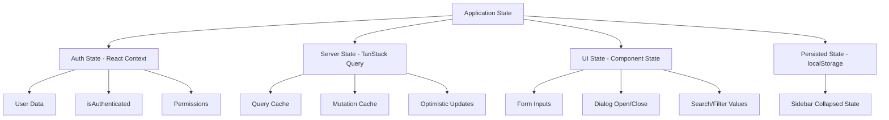
```mermaid
flowchart TD
    A[Application State] --> B[Auth State - React Context]
    A --> C[Server State - TanStack Query]
    A --> D[UI State - Component State]
    A --> E[Persisted State - localStorage]

    B --> B1[User Data]
    B --> B2[isAuthenticated]
    B --> B3[Permissions]

    C --> C1[Query Cache]
    C --> C2[Mutation Cache]
    C --> C3[Optimistic Updates]

    D --> D1[Form Inputs]
    D --> D2[Dialog Open/Close]
    D --> D3[Search/Filter Values]

    E --> E1[Sidebar Collapsed State]
```

---

## 10. Deployment Flow

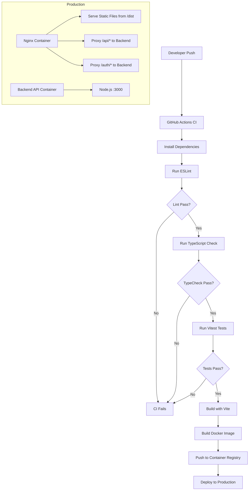
```mermaid
flowchart TD
    A[Developer Push] --> B[GitHub Actions CI]
    B --> C[Install Dependencies]
    C --> D[Run ESLint]
    D --> E{Lint Pass?}
    E -->|No| F[CI Fails]
    E -->|Yes| G[Run TypeScript Check]
    G --> H{TypeCheck Pass?}
    H -->|No| F
    H -->|Yes| I[Run Vitest Tests]
    I --> J{Tests Pass?}
    J -->|No| F
    J -->|Yes| K[Build with Vite]
    K --> L[Build Docker Image]
    L --> M[Push to Container Registry]
    M --> N[Deploy to Production]

    subgraph Production
        O[Nginx Container] --> P[Serve Static Files from /dist]
        O --> Q[Proxy /api/* to Backend]
        O --> R[Proxy /auth/* to Backend]
        S[Backend API Container] --> T[Node.js :3000]
    end
```

---

## 11. Component Communication Flow

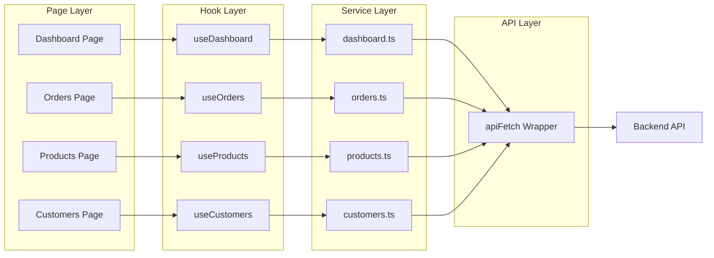
```mermaid
flowchart LR
    subgraph "Page Layer"
        A[Dashboard Page]
        B[Orders Page]
        C[Products Page]
        D[Customers Page]
    end

    subgraph "Hook Layer"
        E[useDashboard]
        F[useOrders]
        G[useProducts]
        H[useCustomers]
    end

    subgraph "Service Layer"
        I[dashboard.ts]
        J[orders.ts]
        K[products.ts]
        L[customers.ts]
    end

    subgraph "API Layer"
        M[apiFetch Wrapper]
    end

    A --> E --> I --> M
    B --> F --> J --> M
    C --> G --> K --> M
    D --> H --> L --> M

    M --> N[Backend API]
```

---

## 12. Error Handling Flow

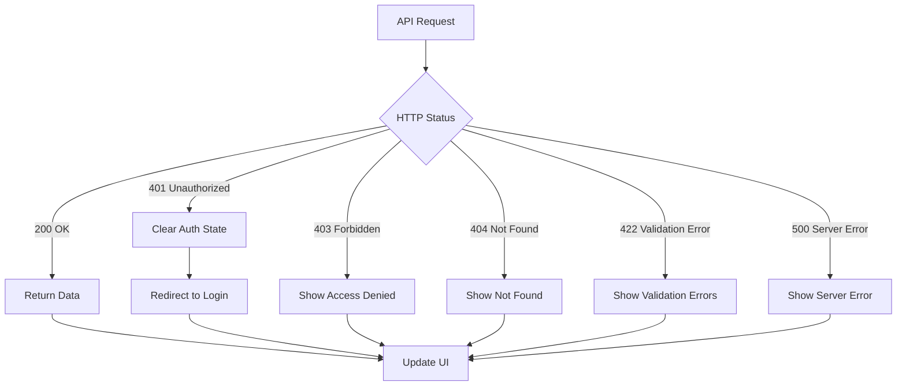
```mermaid
flowchart TD
    A[API Request] --> B{HTTP Status}
    B -->|200 OK| C[Return Data]
    B -->|401 Unauthorized| D[Clear Auth State]
    D --> E[Redirect to Login]
    B -->|403 Forbidden| F[Show Access Denied]
    B -->|404 Not Found| G[Show Not Found]
    B -->|422 Validation Error| H[Show Validation Errors]
    B -->|500 Server Error| I[Show Server Error]
    C --> J[Update UI]
    E --> J
    F --> J
    G --> J
    H --> J
    I --> J
```

---

## Summary

| Flow | Key Components | API Endpoints |
|------|---------------|---------------|
| **Auth** | AuthProvider, CustomerAuthProvider, ProtectedRoute | /auth/login, /auth/me, /auth/customer/login, /auth/customer/me |
| **Dashboard** | Dashboard.tsx, useDashboard, OrdersChart | /api/dashboard |
| **Orders** | Orders.tsx, useOrders, CreateOrderDialog | /api/orders |
| **Products** | Products.tsx, useProducts, CreateProductDialog | /api/products |
| **Customers** | Customers.tsx, useCustomers, CreateCustomerDialog | /api/customers |
| **Inventory** | Inventory.tsx, useStockTransactions | /api/stock-transactions |
| **Audit Logs** | AuditLogs.tsx, useAuditLogs | /api/audit-logs |
| **Users** | UserManagement.tsx, useUsers | /api/users |
| **Form Templates** | FormTemplates.tsx, useFormTemplates | /api/form-templates |
| **Customer Groups** | CustomerGroups.tsx, useCustomerGroups | /api/groups |
| **Customer Portal** | CustomerOrderPage.tsx, useCustomerPortal | /api/customer/catalog, /api/customer/orders |
